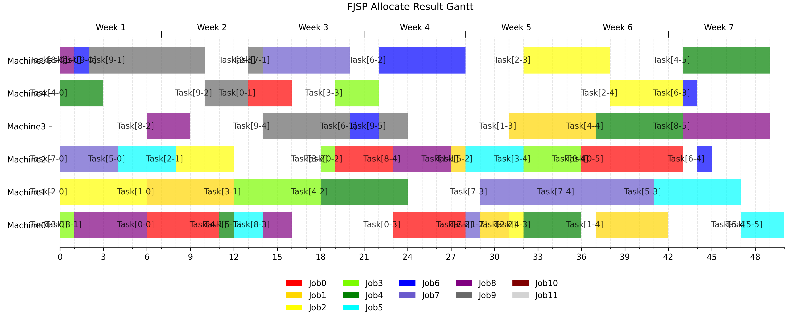
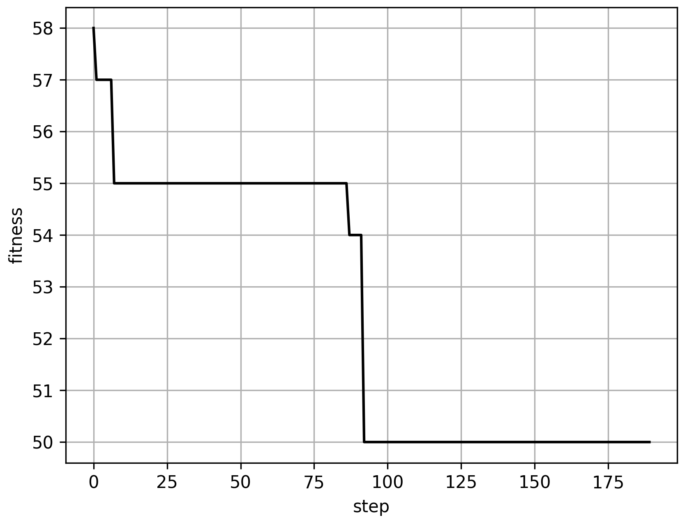

[Endlish](README.md)|[简体中文](README_cn.md)

# Intelligent Algorithm Scheduler

#### 介绍
本仓库目前提供两种模型：
1. 用智能算法解决FJSP问题。并绘制甘特图。

``` python ./JSSP_executor.py ```





2. 用智能算法解决云计算调度类问题，可以更换评价函数、绘图并存储结果和图表，需要注意的是，全都是离散调度问题，也就是说所有粒子群都是离散粒子群算法。
另外正在实现图上的优化算法，以及柔性车间任务调度问题。

``` python ./simulate.py ```

#### 代码结构
```
root
└─JSSP_executor.py
└─fjspkits/
│    └─fjsp_entities.py: Job, Task, Machine 的定义。
│    └─fjsp_utils.py: read_file 通过文件读取生成数据, calculate execute time 计算每个机器的执行时间.
│    └─FJSP_GAModel.py: FJSP model 工作流类.
└─simulate.py: 用于云服务负载均衡调度的类 This code can be run to obtain results, and algorithms, data, and parameters can be changed within it.
└─schedulers/
│    └─*.py, 算法库.
└─utils/
│    └─Entities : This file includes some entities that could tasks need. such as Cloudlet(cloud tasks to allocated), VM(containers Virtual Machines to execute tasks(cloudlets)).
│    └─plottools.py: 绘制甘特图
└─SchedulerScaleandFitness.py: This file is used to compare the optimal solutions of multiple algorithms and their convergence curves.
└─Schedulers.py: Similar to the above, it includes comparative experiments for different groups.
└─chaosTest.py: Similar to the above, it includes comparative experiments for different groups.
```

并非每一个算法都有论文依据，因为这些算法里面有自己的改进尝试。
- GA: Genetic Algorithm 遗传算法
- SA: Simulated Annealing Algorithm 模拟退火算法
- ACO: Ant Colony Optimization Algorithm 蚁群算法
- PSO: Particle Swarm Optimization Algorithm 粒子群算法
- CRPSO: Chaotic Hierarchical Gene Replication 基于混沌策略的基因层次复制优化算法
- DPSO: discrete PSO离散粒子群算法
- CDPSO: Chaotic PSO 基于混沌优化策略的离散粒子群算法
- TSA: Taboo Search Algorithm 禁忌搜索算法
- others

ChaosDPSO（混沌优化离散粒子群算法）、ChaosHPSO（稍作修改的混沌优化粒子群算法）、newPSO（稍作改进提升粒子群算法）、DPSO（二进制粒子群算法，不过其实是普通的离散粒子群算法）、ACO（蚁群算法）、SA（模拟退火算法）、GA（遗传算法）、TS（禁忌搜索算法有待修改，目前可能有误）

utils/*.py: 工具类[README.md](README.md)

其他以及未介绍的代码都是工具类或者当年的废弃代码

### 测试案例
``` python ./JSSP_executor.py ```

``` python ./simulate.py ```

#### 使用说明

1.  实验对象参数有改动，在Entities.py里面修改，例如添加实验属性
2.  其他算法如需改动流程，在对应算法里面修改
3.  在Scheduler.py里直接修改各个算法的种群数量和迭代次数，也可统一修改
4.  是否生成数据或生成图片并保存到本地，通过在Scheduler.py注释相应代码修改
5.  粒子群的改进在于产生新解时用了一些倒置、交换、移动等等操作增强产生新解的能力

## 图上的优化
主要是有向无环图（DAG）上的任务的优化，图结构最常用的就是任务排程
- ./GraphAlgorithm.py
- ./datastructure/ActivityGraph.py AOV和AOE图的实现。
- ./datasets/graph_example/*.txt

### 拓扑排序
ActivityGraph.py 实现了AOV(Activity on Vertex)和AOE(Activity on Edge)模型，并且提供了一下功能：
- AOV.topological_sort_all(self)：对图进行拓扑排序
- AOV.check_path(self, path)：给定数组，判断是否是拓扑序（还没实现子序列）
- AOE.critical_path(self): 找出关键路径


#### Reference

1. Holland J.(1992). [Genetic Algorithm](https://doi.org/10.1038/scientificamerican0792-66)
2. Kennedy J, Eberhart R.(1995). Particle Swarm Optimization 
3. Ke Zhao.(2021). [Research on Edge Cloud Load Balancing Strategy based on Chaotic Hierarchical Gene Replication](https://www.fujipress.jp/jaciii/jc/jacii002600050758/)
4. [Job_Shop_Schedule_Problem](https://github.com/mcfadd/Job_Shop_Schedule_Problem)

#### 参与贡献

1.  Fork 本仓库
2.  新建 Feat_xxx 分支
3.  提交代码，注意必须统一代码风格
4.  新建 Pull Request
